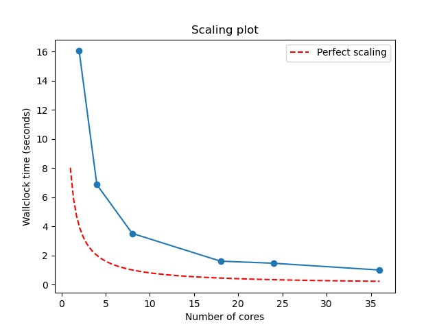

::: questions
- "How do I combine steps into a workflow?"
- "How do I make a step that uses the outputs from a previous step?"
:::

::: objectives
- "Create workflow pipelines with dependencies"
- "Use the outputs of one step as inputs to the next"
:::

## A pipeline of multiple rules

In this episode, we will plot the scaling results generated in the last
episode using the script `plot_terse_amdahl_results.py`. These results
report how long the work of running `amdahl` took when using between
2 and 36 processes.

We want to plot these results automatically, i.e. as part of our workflow.
In order to do this correctly, we need to make sure that our python
plotting script runs only **after** we have finished calculating all
results.

We can control the order and relative timing of when steps execute
by defining dependencies.

For example, consider the following YAML, `depends.yaml`:

```yml
description:
    name: Dependency-exploration
    description: Experiment with adding dependencies

batch:
    type: slurm
    host: quartz # machine to run on
    bank: guest # bank
    queue: pbatch # partition

env:
    variables:
      OUTPUT_PATH: ./Episode5
      OUTPUT: date.txt

study:
    - name: date-batch
      description: Write the date and node's hostname to a file
      run:
          cmd: |
              echo "From batch node:" >> $(OUTPUT)
              hostname >> $(OUTPUT)
              date >> $(OUTPUT)
              sleep 10
          nodes: 1
          procs: 1
          walltime: "00:00:30"
    - name: date-login
      description: Write the date and login node's hostname to a file
      run:
          cmd: |
              echo "From login node:" >> $(OUTPUT)
              hostname >> $(OUTPUT)
              date >> $(OUTPUT)
              sleep 10
```

This script has two steps, each of which writes the type of
node of its host, the particular hostname, and the date/time
before waiting for 10 seconds. The step `date-login` is run
on a login node and the step `date-batch` is run on a "batch"
or "compute" node.

::: challenge

Run the above script with

```bash
maestro run depends.yaml
```

You can then `cat` the output of both steps to `stdout` via a
command of the form 

```bash
cat Episode5/Dependency-exploration-{FILL}/date-*/*.txt
```

where `{FILL}` should be replaced by the date/time info of
this run. This will print the output of the two steps to
`stdout`.

Which step is printed first and how close together are they
completed?

:::::: solution

You'll likely see output somewhat similar to

```bash
(maestro_venv) janeh@pascal83:~$ cat Episode5/Dependency-exploration_20240326-143559/date-*/date.txt
```
```output
From batch node:
pascal16
Tue Mar 26 14:36:04 PDT 2024
From login node:
pascal83
Tue Mar 26 14:36:03 PDT 2024
```

though the times/dates and hostnames will be different.
We didn't try to control the order of operations, so
each step will have run as soon as it had resources.
Probably you'll see that the timestamp on the login node
is earlier because it will not have to wait for resources
from the queue.

::::::
:::

Next, let's add a dependency to ensure that the batch step
runs **before** the login node step. To add a dependency
a line with the following format must be added to a step's
`run` block:

```yml
        depends: [`{STEP NAME}`]
```

`{STEP NAME}` is replaced by the name of the step from the
study that you want the current step to depend upon. 

If we update `date-login` to include a dependency, we'll see

```yml
    - name: date-login
      description: Write the date and login node's hostname to a file
      run:
          cmd: |
              echo "From login node:" >> $(OUTPUT)
              hostname >> $(OUTPUT)
              date >> $(OUTPUT)
              sleep 10
          depends: [date-batch]
```

Now `date-login` will not run until `date-batch` has finished.

::: challenge

Update `depends.yaml` to make `date-login` wait for `date-batch`
to complete before running. Then rerun `maestro run depends,yaml`.

How has the output of the two `date.txt` files changed?

::::::solution

This time, you should see that the date printed from the
login node is *at least* 10 seconds later than the date
printed on the batch node. For example, on Pascal I see

```bash
$ cat Episode5/Dependency-exploration_20240326-150950/date-*/date.txt
```

```output
From batch node:
pascal16
Tue Mar 26 15:09:54 PDT 2024
From login node:
pascal83
Tue Mar 26 15:10:53 PDT 2024
```
::::::
:::

## A step that waits for all iterations of its dependency

Let's return to our Amdahl scaling study and the YAML
with which we ended in the last episode:

```yml
description:
    name: Amdahl
    description: Run a parallel program

batch:
    type: slurm
    host: quartz # machine to run on
    bank: guest # bank
    queue: pbatch # partition

env:
    variables:
      P: .999
      OUTPUT: amdahl.json
      OUTPUT_PATH: ./Episode5

study:
    - name: amdahl
      description: run in parallel
      run:
          # Here's where we include our MPI wrapper:
          cmd: |
               $(LAUNCHER) amdahl --terse -p $(P) >> $(OUTPUT)
          nodes: 1
          procs: $(TASKS)
          walltime: "00:01:30"

global.parameters:
    TASKS:
        values: [2, 4, 8, 18, 24, 36]
        label: TASKS.%%
```

Ultimately we want to add a plotting step that depends upon
`amdahl`, but for now let's create a placeholder that will
go under `study` and beneath `amdahl`:

```
   - name: plot
      description: Create a plot from `amdahl` results
      run:
          # We'll update this `cmd` later
          cmd: |
               echo "This is where we plot"
```

Based on what we saw before, we might think that we just
need to add

```
          depends: [amdahl]
```

to the end of this block. Instead, the syntax changes
slightly because `amdahl` is parameterized -- i.e. it will
run for several task values. To indicate that we want `plot`
to run after *ALL* `amdahl` steps, we'll add a `_*` to the
end of the step name:

```
          depends: [amdahl_*]
```

Now our new step definition will look like

```yml
   - name: plot
      description: Create a plot from `amdahl` results
      run:
          # We'll update this `cmd` later
          cmd: |
               echo "This is where we plot"
          depends: [amdahl_*]
```

## Using the outputs from a previous step

### Manually plotting scaling results
In your working directory, you should have a copy of 
`plot_terse_amdahl_results.py`. The syntax for running this script is

```
python3 plot_terse_amdahl_results.py {output image name} {input json filenames}
```

Before trying to add this command to our workflow, let's run it manually
to see how it works. We can call the output image `output.jpg`. As for
the input names, we can use the `.json` files created at the end of
episode 4. In particular if you run

```bash
ls Episode4/Amdahl_<Date>_<Time>/amdahl/TASKS.*/amdahl.json
```
using the `<Date>` and `<Time>` of your last run in Episode 4, you should
see a list of files named `amdahl.json`:

```bash
$ ls Episode4/Amdahl_20240326-155434/amdahl/TASKS.*/amdahl.json
```
```output
Episode4/Amdahl_20240326-155434/amdahl/TASKS.18/amdahl.json
Episode4/Amdahl_20240326-155434/amdahl/TASKS.24/amdahl.json
Episode4/Amdahl_20240326-155434/amdahl/TASKS.2/amdahl.json
Episode4/Amdahl_20240326-155434/amdahl/TASKS.36/amdahl.json
Episode4/Amdahl_20240326-155434/amdahl/TASKS.4/amdahl.json
Episode4/Amdahl_20240326-155434/amdahl/TASKS.8/amdahl.json
```

You can use this same filepath with wildcards to specify this list of
JSON files as inputs to our python script:

```bash
python3 plot_terse_amdahl_results.py output.jpg Episode4/Amdahl_<Date>_<Time>/amdahl/TASKS.*/amdahl.json
```

::: challenge

Generate a scaling plot by manually specifying the JSON files
produced from a previous run of `amdahl.yaml`.

:::::: solution

The resulting JPEG should look something like



::::::
:::

### Adding plotting to our workflow

Let's update our `plot` step in `amdahl.yaml` to include python plotting
rather than a placeholder `echo` command. We want the updated step to look
something like

```yml
   - name: plot
      description: Create a plot from `amdahl` results
      run:
          cmd: |
               python3 plot_terse_amdahl_results.py output.jpg Episode5/Amdahl_<Date>_<Time>/amdahl/TASKS.*/amdahl.json
          depends: [amdahl_*]
```

The trouble is that we don't know the exact value of 
`Episode5/Amdahl_<Date>_<Time>/amdahl` for a job that we haven't run
yet. Luckily Maestro gives us a placeholder to the equivalent of this path
for the current job --- `$(amdahl.workspace)`. This is the workspace for
the `amdahl` step, where all outputs for `amdahl`, including our `TASKS.*`
directories, are written.

This means we can update the `plot` step as follows:

```yml
   - name: plot
      description: Create a plot from `amdahl` results
      run:
          cmd: |
               python3 plot_terse_amdahl_results.py output.jpg $(amdahl.workspace)/TASKS.*/amdahl.json
          depends: [amdahl_*]
```

::: callout

Where does the `plot_terse_amdahl_results.py` script live? In Maestro,
`$(SPECROOT)` specifies the root directory from which you originally
ran `maestro run...`. This is where `plot_terse_amdahl_results.py` should
live, so let's be more precise:

```yml
   - name: plot
      description: Create a plot from `amdahl` results
      run:
          cmd: |
               python3 $(SPECROOT)/plot_terse_amdahl_results.py output.jpg $(amdahl.workspace)/TASKS.*/amdahl.json
          depends: [amdahl_*]
```

:::

::: challenge

Update `amdahl.yaml` so that 

* one step definiton runs `amdahl` for 85% parallelizable code using [2, 4, 8, 16, 32] tasks
* a second step plots the results.

::::::solution

Your YAML file should look something like

```yml
description:
    name: Amdahl
    description: Run a parallel program

batch:
    type: slurm
    host: quartz # machine to run on
    bank: guest # bank
    queue: pbatch # partition

env:
    variables:
      P: .85
      OUTPUT: amdahl.json
      OUTPUT_PATH: ./Episode5

study:
    - name: run-amdahl
      description: run in parallel
      run:
          # Here's where we include our MPI wrapper:
          cmd: |
               $(LAUNCHER) amdahl --terse -p $(P) >> $(OUTPUT)
          nodes: 1
          procs: $(TASKS)
          walltime: "00:01:30"
    - name: plot
      description: Create a plot from `amdahl` results
      run:
          cmd: |
               python3 $(SPECROOT)/plot_terse_amdahl_results.py output.jpg $(run-amdahl.workspace)/TASKS.*/amdahl.json
          depends: [amdahl_*]

global.parameters:
    TASKS:
        values: [2, 4, 8, 16, 32]
        label: TASKS.%%

```

::::::
:::


::: callout

## Errors are normal

Don't be disheartened if you see errors when first testing
your new Maestro pipelines. There is a lot that can go wrong when writing a
new workflow, and you'll normally need several iterations to get things just
right. Luckily, `Maestro` will do some checks for consistency at the outset
of the run. If you specify a dependency that doesn't exist (because of a
rename, for example), the job will fail before submitting work to the queue.

:::


::: keypoints
- "We can control the order of steps run in a study by creating dependencies."
- "You can create a dependency with the `depends: [{step name}]` syntax."
- "Dependency syntax changes to `depends: [{step name}_*]` for parameterized steps."
:::

